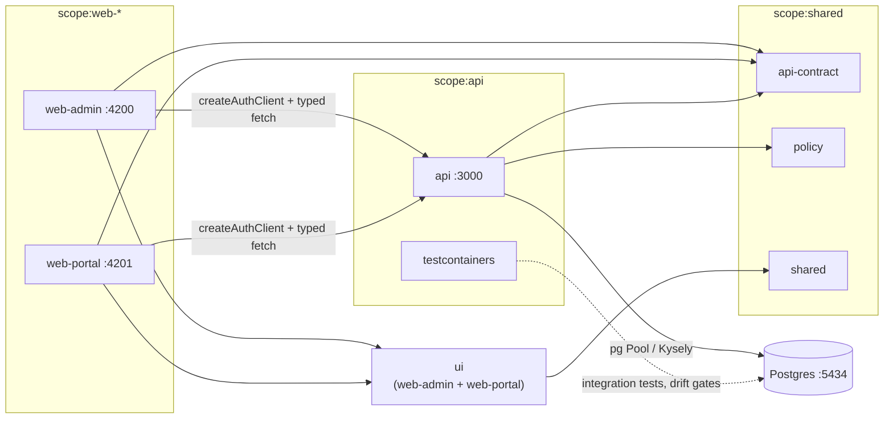
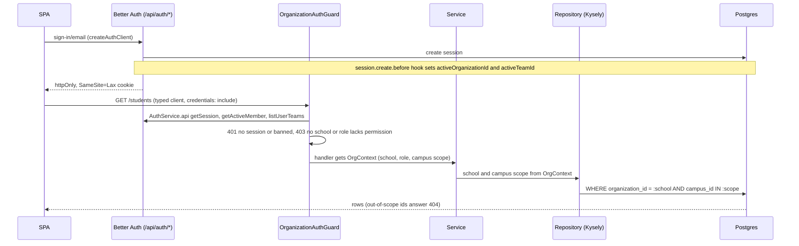

# Architecture

Two React SPAs and one NestJS API share a typed contract. Better Auth owns identity and school/campus membership; Eduvault owns the domain tables and every rule about who may see what.

## Module boundaries

| Project                            | Tag                                   | May depend on                      |
| ---------------------------------- | ------------------------------------- | ---------------------------------- |
| `web-admin`                        | `scope:web-admin`                     | `scope:shared`, `scope:web-admin`  |
| `web-portal`                       | `scope:web-portal`                    | `scope:shared`, `scope:web-portal` |
| `api`, `testcontainers`, `scripts` | `scope:api`                           | `scope:shared`, `scope:api`        |
| `api-contract`, `policy`, `shared` | `scope:shared`                        | `scope:shared`                     |
| `ui`                               | `scope:web-admin`, `scope:web-portal` | `scope:shared`                     |

`ui` carries both web tags so each SPA may import it and the API may not. Enforced by `@nx/enforce-module-boundaries`; a violation fails `nx lint`.

## Request and auth flow

`OrgContext` carries the active school, the member's role, the active campus, and the campus scope: `'all'` for owner/admin, otherwise the campuses the user belongs to. Services never read the session themselves, and only repositories talk to the database, so the ORM can be replaced without touching services.

## Tenancy model

- **Organization = school.** `member.role` is the role in that school, so one user can be a teacher in one school and an admin in another. `session.activeOrganizationId` selects the school.
- **Team = campus.** `teamMember` says where someone works; `session.activeTeamId` selects the campus. Details beyond a name are in the `campus` table (`team_id` primary key and foreign key to `team.id`).
- **School level:** `school_account` (one per school). **Campus aware:** `fee_schedule` (null `campus_id` = every campus) and `student`.
- Every school-scoped table carries `organization_id`; campus references are composite `(campus_id, organization_id)` foreign keys, so a row cannot reference another school's campus.
- Decisions and out-of-scope cases: [ADR 0005](adr/0005-tenancy.md).

## What Better Auth owns

Generated by `api:auth-generate` from the options in `apps/api/src/app/common/auth/better-auth-base.ts`; the full output is `apps/api/db/auth-schema.snapshot.sql` and the migration `apps/api/db/migrations/*_better_auth_schema.sql`. Types are `timestamptz` and `text` throughout; every `id` is `text` with `DEFAULT gen_random_uuid()::text` (`generateId: false`).

### Core tables

| Table          | Columns                                                                                                                                                                                          |
| -------------- | ------------------------------------------------------------------------------------------------------------------------------------------------------------------------------------------------ |
| `user`         | `id` PK, `name`, `email` UNIQUE, `emailVerified` boolean, `image`, `createdAt`, `updatedAt`, plus admin-plugin columns below                                                                     |
| `session`      | `id` PK, `expiresAt`, `token` UNIQUE, `createdAt`, `updatedAt`, `ipAddress`, `userAgent`, `userId` FK→`user`, plus plugin columns below                                                          |
| `account`      | `id` PK, `accountId`, `providerId`, `userId` FK→`user`, `accessToken`, `refreshToken`, `idToken`, `accessTokenExpiresAt`, `refreshTokenExpiresAt`, `scope`, `password`, `createdAt`, `updatedAt` |
| `verification` | `id` PK, `identifier`, `value`, `expiresAt`, `createdAt`, `updatedAt`                                                                                                                            |

### `admin` plugin

Adds columns to existing tables; no new tables.

- `user.role` (text), `user.banned` (boolean), `user.banReason` (text), `user.banExpires` (timestamptz)
- `session.impersonatedBy` (text)

Banned users are treated as unauthenticated by `AuthContextService`, and Better Auth refuses their sign-in with 403.

### `organization` plugin (teams enabled)

| Table          | Columns                                                                                                                           |
| -------------- | --------------------------------------------------------------------------------------------------------------------------------- |
| `organization` | `id` PK, `name`, `slug` UNIQUE, `logo`, `createdAt`, `metadata`                                                                   |
| `member`       | `id` PK, `organizationId` FK→`organization`, `userId` FK→`user`, `role`, `createdAt`                                              |
| `invitation`   | `id` PK, `organizationId` FK→`organization`, `email`, `role`, `teamId`, `status`, `expiresAt`, `createdAt`, `inviterId` FK→`user` |
| `team`         | `id` PK, `name`, `memberCount`, `organizationId` FK→`organization`, `createdAt`, `updatedAt`                                      |
| `teamMember`   | `id` PK, `teamId` FK→`team`, `userId` FK→`user`, `membershipKey` UNIQUE, `createdAt`                                              |

Added to `session`: `activeOrganizationId` and, with teams enabled, `activeTeamId`.

Mapping: **organization = school**, **team = campus**, and **`member.role` = a role from `libs/policy`** (`owner`, `admin`, `teacher`, `student`). The `team` permission in `libs/policy` governs who can create, edit or delete campuses.

### Endpoints

All under `/api/auth/*`, mounted by `@thallesp/nestjs-better-auth`. SPAs reach them only through `createEduvaultAuthClient` (`@eduvault/auth-client`, with `organizationClient({ teams: { enabled: true } })`); they never call these URLs by hand.

- **Core:** `sign-in/email`, `sign-in/social`, `sign-out`, `get-session`, `update-user`, `change-email`, `change-password`, `request-password-reset`, `reset-password`, `send-verification-email`, `verify-email`, `list-sessions`, `revoke-session(s)`, `revoke-other-sessions`, `list-accounts`, `link-social`, `unlink-account`, `delete-user`, and related callbacks. Sign-up is off (`sign-up/email` answers 400); accounts are created on the server.
- **Admin, `/admin/*`:** a super admin reaches `list-users`, `get-user`, `ban-user`, `unban-user`, `list-user-sessions`, `revoke-user-session(s)` and `has-permission`; `create-user`, `update-user`, `set-role`, `set-user-password`, `remove-user` and `impersonate-user` answer 403 for everyone (D-079).
- **Organization, `/organization/*`:** `create`, `update`, `delete`, `list`, `check-slug`, `set-active`, `get-full-organization`, `get-organization`, `list-members`, `get-active-member(-role)`, `update-member-role`, `remove-member`, `leave`, `invite-member`, `accept/reject/cancel-invitation`, `list-invitations`, `list-user-invitations`, `has-permission`, and, for teams, `create-team`, `update-team`, `remove-team`, `list-teams`, `list-user-teams`, `set-active-team`, `add-team-member`, `remove-team-member`, `list-team-members`.

### Ownership boundary

- **Better Auth owns** the tables and endpoints above, password hashing, sessions and cookies, and invitations.
- **Eduvault owns** the domain tables (`campus`, `school_account`, `fee_schedule`, `student`), the role permissions (`libs/policy`), the guards, and the active-school and active-campus scoping of every query.
- Eduvault never writes Better Auth's tables except through `AuthService.api` (creating a campus calls `createTeam`; the `campus` row is ours). It reads them in the session hook, which uses SQL for the first membership.

### Workflow

1. Change the options in `better-auth-base.ts`.
2. `nx run api:auth-generate`: runs `better-auth generate` against a migrated throwaway database, and writes anything missing as a new dbmate migration, refreshing `auth-schema.snapshot.sql`.
3. Review the migration diff.
4. `nx run api:db-codegen` (or `pnpm drift:fix`) to regenerate the Kysely types and `schema.sql`.
5. `pnpm drift` is the gate: it fails if the snapshot differs from a fresh generation, or if the migrations do not satisfy Better Auth.
